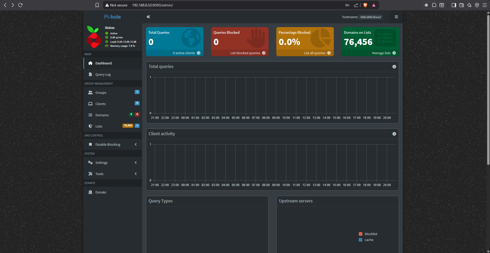
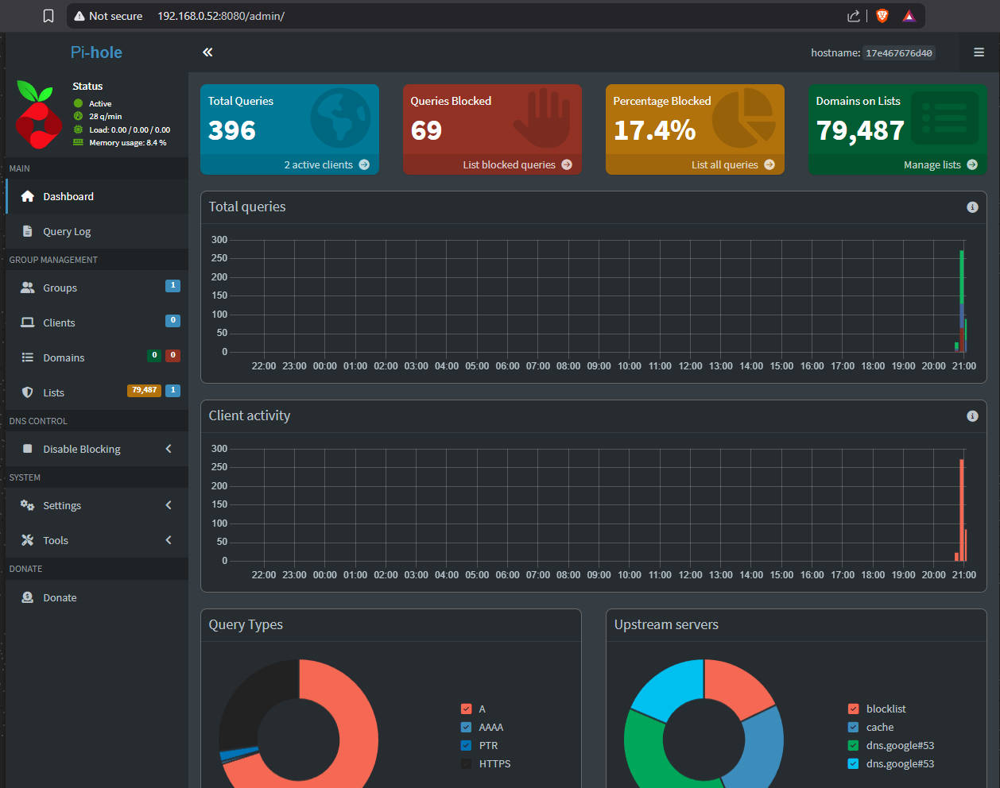

# Projektarbeit Cyber Security

Projektarbeit im Rahmen des Fachs "Cyber Security" im "Informatiker HF"-Lehrgang an der Teko.

## Inhalt
- [Der Plan](#der-plan)
- [Die Ausführung](#die-ausführung)
    - [Firewall](#firewall)
    - [Pi-hole](#pi-hole)
    - [VPN](#vpn)


## Der Plan

Ich habe schon länger mit dem Gedanken gespielt, meinen alten PC zu einem Home-Server umzubauen, mir hat aber der Anstoss gefehlt, da kommt mir diese Projektarbeit sehr gelegen.

Geplant ist die Installation und Konfiguration folgender Dienste: 

- **Pi-hole:** Zur Blockierung von Werbung in meinem Heimnetzwerk.
- **VPNs:** Zur Verbesserung der Sicherheit, falls ich mal auf öffentliche Hotspots angewiesen sein sollte und auch auf meinen mobilen Geräten vom Pi-hole profitieren kann.
- **Firewall:** Zur Verbesserung der Sicherheit meines Heimnetzwerks.

**Infrastructure as Code:** Zusätzlich habe ich für mich die Anforderung, dass ich diese Dienste automatisiert installieren und konfigurieren können will. Sprich das Hauptprodukt dieser Arbeit werden die Skripts sein, mit denen sich diese Dienste installieren lassen können.

Da ich über keinerlei Erfahrungen mit dem Einrichten dieser Dienste und dem Konzept von Infrastructure as Code habe, habe ich mir zur groben Planung des Projekts ChatGPT zu Hilfe gezogen. 

Ursprünglich war folgende Projektstruktur geplant:

```
cyber-security-projektarbeit/
│
├── ansible/
│   ├── inventories/
│   │   ├── lab.yml
│   │   └── production.yml
│   │
│   ├── roles/
│   │   ├── base/
│   │   ├── docker/
│   │   ├── pihole/
│   │   ├── wireguard/
│   │   └── firewall/
│   │
│   └── site.yml
│
├── docker/
│   ├── pihole/
│   │   └── docker-compose.yml
│   └── reverse-proxy/ (future)
│
└── README.md/
```

Die Automatisierung soll mit Ansible, einer open-source Technologie zur Automatisierung von IT Tasks, durchgeführt werden. ChatGPT hat mir diese Technologie vorgeschlagen, denn damit kann man die Scripts von einem Host aus via SSH automatisch auf den Zielservern ausführen lassen. Leider hat das nicht ganz so gut geklappt wie ich mir das vorgestellt habe, doch dazu in der Ausführung mehr.

### Testumgebung

Wie einigen in der File-Struktur vielleicht bereits aufgefallen ist, sind zwei Environments geplant - `lab` und `production`. Ersteres soll eine VM sein, welche ich auf meinem PC betreibe, während `production` mein Home-Server / alter PC sein wird. Dies vor allem aus dem Grund, dass ich den Home-Server mangels Anschlüsse nicht in meinem Büro betreiben kann. Zudem lässt sich eine VM auch einfacher wiederherstellen, wenn etwas nicht ganz klappen sollte.

## Die Ausführung

### Lab-Environment 

Um die Ansible-Skripts zu testen, habe ich mit VirtualBox eine Ubuntu 24.04.4 LTS VM erstellt und diese mit einem Bridge-Adapter in meinem LAN verfügbar gemacht. Um mich mit der VM verbinden zu können, musste hier als erstes SSH installiert werden.

### Ansible

Ansible habe ich via WSL auf meinem Windows-PC installiert. 
Damit Ansible Zugriff auf das Lab-Environment erhält und die Skripts ausführen kann, habe ich folgende Konfiguration erstellt:

> [inventories/lab.yml](ansible/inventories/lab.yml)

Eine fast identische Konfiguration wird auch für den Home-Server erstellt:

> [inventories/production.yml](ansible/inventories/production.yml)

Da die Maschine aktuell noch nicht eingerichtet ist, sind hier vorerst nur Platzhalter eingefügt.

Anschliessend habe ich von Ansible die Ordner- und Filestruktur generieren lassen:

```sh
cd cyber-security-projektarbeit/ansible
ansible-galaxy init roles/docker`
```

Für die Erstellung des Docker-Skripts bin ich einem [Tutorial](https://www.digitalocean.com/community/tutorials/how-to-use-ansible-to-install-and-set-up-docker-on-ubuntu-22-04) von DigitalOcean gefolgt. Leider bin ich dabei auf einen Fehler gestossen, den ich auch mit ChatGPT und Gemini nicht gelösst bekommen habe: 

```
TASK [docker : Install Docker CE and required plugins] ************************************************************************************************************************************************************
[ERROR]: Task failed: Module failed: No package matching 'docker-ce' is available
Origin: /home/ddev/automation/cyber-security-projektarbeit/ansible/roles/docker/tasks/install.yml:41:3

39     filename: docker
40
41 - name: Install Docker CE and required plugins
     ^ column 3

fatal: [lab]: FAILED! => {"changed": false, "msg": "No package matching 'docker-ce' is available"}
```

Da Docker eigentlich nicht Teil der Technologien ist, um die es in dieser Arbeit gehen sollte, habe ich nach mehreren Stunden herumprobieren entschieden, diesen Schritt manuell durchzuführen.


Ansible-Skripte ausführen (für Testdurchläufe kann `--check` angefügt werden): 
``` sh
ansible-playbook -i inventories/lab.yml lab-playbook.yml -K
```


### Pi-hole

Pi-hole installation via https://github.com/pi-hole/docker-pi-hole

Musste den DNSStubListener deaktivieren, um den Pi-hole Container an port 53 binden zu lassen.




### VPN

Als VPN installiere ich Wireguard. Damit Wireguard dann auch mit dem Pi-hole zusammen funktioniert, musste ich im Docker-Installationsskript ein geteiltes Netzwerk erstellen, an welches sich beide Container anschliessen können. Bei der Erstellung der docker-compose Datei für Wireguard habe ich mich von Gemini unterstützen lassen. Dazu gab ich der KI eine grobe Beschreibung der bisherigen Konfigurationen und die Pi-hole docker-compose Datei als Kontext.



### Firewall


## Resultat

Um dieses Setup jetzt effektiv einsetzen zu können, müsste ich lediglich mein Ubuntu-Image auf meinem Home-Server installieren, die Skripte laufen lassen und im Router meines LAN den DNS Server auf die IP-Adresse des Home-Servers umstellen. Leider konnte ich das bisher aber noch nicht testen.

